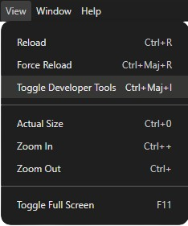

# Freedom Loader

 

> This project aims to enable free, open-source, and unrestricted downloading of Video/Audio content. Eventually, it will allow users to choose

## 🚀 Features

✅ Video Download (MP4)  
✅ Audio Download (MP3)  
✅ Detailed Logs (Console + Logs)  
✅ Automatic Fetch of Information  
✅ Playlist Download

---

## 🔧 Installation

To install the application, simply download the installer from the releases section. Take the latest version and run it.

---

## ❓ Frequently Asked Questions

### _Where are my downloaded files located?_

In your computer's Downloads folder (**C:\Users\YOUR NAME\Downloads**), inside a folder named **Freedom Loader Output**  
 

### _After installing and running the program, I get an error_

Try restarting the application, checking the logs, or opening the browser's developer console by pressing `CTRL + SHIFT + I` or by going to `View > Toggle Developer Tools`

<!--  -->

  

## 🏗️ Upcoming Features (Roadmap)

- [ ] More format options
- [ ] Subtitle support
- [ ] Improved UI / UX
- [ ] Language selection
- [ ] Download a specific part of the video
- [ ] Rename output file
- [ ] Extract / Split video using native chapters
- [ ] Parallel downloads
- [ ] Skip sponsored parts of videos
- [ ] Custom output path selection (default **C:\Users\Username\Downloads** with a **Freedom Loader Output** folder created)

---

## 🖼️ Preview

  

> Here is an example of the app after launch and entering a URL

---

## ℹ️ About

This project was built using   
Thanks to them for providing a free and open-source API.

This project is open-source and welcomes your contributions.  
Here is how to get involved:

- **🪲 Bug Reporting**  
   Please use the [GitHub issues system](https://github.com/MasterAcnolo/Freedom-Loader/issues) to report any bugs you encounter.  
   Try to provide clear reproduction steps and logs if possible. Logs are located in the installation folder of the program. Example path:  
   `C:\Users\[YOUR NAME]\Desktop\Freedom Loader\resources\app\logs`  
   The log file will be named something like `combined-20xx-xx-xx.log`  
    
- **🛠️ Contribution**  
   Pull Requests are welcome! Please fork the repo and submit your PR after ensuring you meet the contribution guidelines (tests, style, etc.).  
    
- **💡 Feature Suggestions**  
   You can propose new ideas via a [feature request issue](https://github.com/MasterAcnolo/Freedom-Loader/issues).  
   Any clear and detailed proposal will be reviewed.  
    
- **💰 Support the Project**
    
  
    If you'd like to support me, you can donate via  
      
    

---

## 📄 License

This project is licensed under the **MIT License** — see the [LICENSE](./LICENSE) file for details.

---

## ⚠️ Disclaimer

I have obviously used AI assistance for some parts of this project. Use AI sparingly and always be aware of what you are doing.
