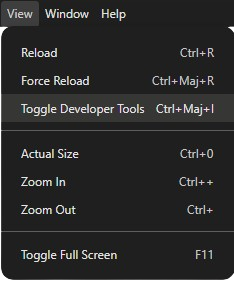
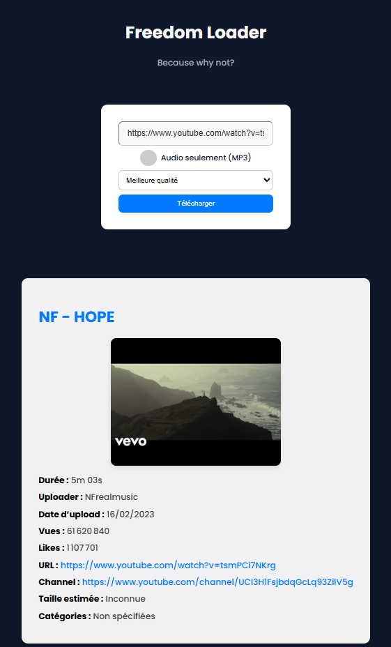

# Freedom Loader

Freedom Loader is a Windows desktop application built with Electron.  
It provides a simple and reliable way to download video or audio content with metadata and advanced options, without ads or questionable third-party services.  
The goal is to offer a clean, user-friendly, and transparent download experience. It's important for me to make media content downloading accessible to people who love music or videos and don’t always have an internet connection.

---

## Features

- Video download with metadata (MP4)
- Audio-only download with thumbnail and tags (MP3)
- Full playlist support
- Automatic metadata retrieval (title, duration, author, etc.)
- Detailed logs (console + rotating files for 7 days)
- Custom output path with persistence
- Automatic dependency updates (YT-DLP)
- Multiple UI themes
- Simple, responsive interface
- Notifications on download completion (click to open folder)
- Discord Rich Presence

---

## Installation

Download the latest installer from the **Releases** page and run it (Defender could stop you but click on "Run Anyway" and it's good).  
No additional setup is required.

---

## FAQ

### Where are my downloaded files stored?

In your **Downloads** folder, inside **Freedom Loader**.  
Example path:  
`C:\Users\[YOUR NAME]\Downloads\Freedom Loader`

### I get an error after launching the app

Try restarting the application, checking the logs, or opening the developer console:  
`CTRL + SHIFT + I` -> “Toggle Developer Tools”.

  

---

## Roadmap

- [ ] Website for Freedom Loader
- [ ] More format options
- [ ] Linux version
- [ ] Mobile version (APK)
- [x] Auto-updating YT-DLP
- [ ] Automatic project updates
- [ ] Better download status
- [ ] Better website support (currently only YouTube is fully supported)
- [ ] Subtitle support
- [ ] UI/UX improvements
- [ ] Language selection
- [ ] Download specific parts of a video
- [ ] Custom file naming
- [ ] Parallel downloads
- [ ] Automatic sponsor skipping
- [x] Extract/split video using native chapters
- [x] Custom output path selection

---

## Preview

  

---

## ℹ Technologies

This project uses:  

Huge thanks to the yt-dlp team for providing an outstanding open-source tool.

---

## Contributing

Contributions are welcome.

### Bug Reports

Use the GitHub Issues system and include reproduction steps and logs when possible.  
Logs can be found here:  
`C:\Users\[USERNAME]\Desktop\Freedom Loader\resources\app\logs\combined-20xx-xx-xx.log`

### Feature Requests

Open a feature request issue with a clear description and use cases.

### Pull Requests

Fork the repository, make your changes, and submit a PR once everything is tested and clean.

---

## Support the Project

If you'd like to support development:

---

## License

Freedom Loader is released under the **GNU General Public License v3.0 (GPLv3)**.  
You are free to use, modify, and redistribute the software under the terms of this license.

See the full license in the [LICENSE](./LICENSE) file.

---

## Note

AI assistance was used occasionally to speed up development, but all code and decisions were reviewed and validated manually.
