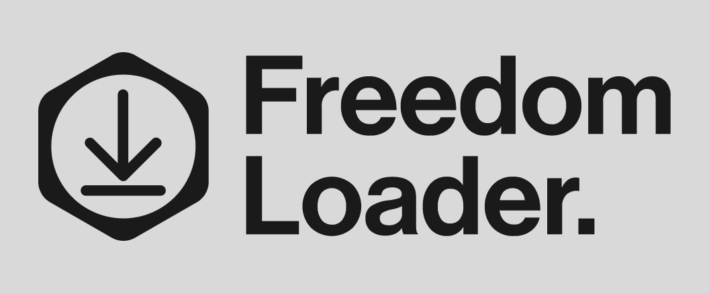

<div align="center">

  <a href="https://masteracnolo.github.io/FreedomLoader/"></a>

### **A clean, open-source multimedia downloader for Windows**

[](https://github.com/MasterAcnolo/Freedom-Loader/releases)
[](https://www.gnu.org/licenses/gpl-3.0)
[](https://masteracnolo.github.io/FreedomLoader/)
  <a href="https://www.firefox.com/fr/?utm_campaign=SET_DEFAULT_BROWSER"></a>

</div>

---

## Overview

Freedom Loader is a desktop application built with Electron that provides a straightforward way to download video and audio content with full metadata support. The application focuses on reliability, transparency, and user privacy-no ads, no tracking, no questionable third-party services.

The primary goal is to make media downloading accessible to users who want offline access to their favorite content, particularly in situations where internet connectivity is unreliable or unavailable.

## Table of Contents

- [Features](#features)
- [Installation](#installation)
- [Usage](#usage)
- [Preview](#preview)
- [Configuration](#configuration)
- [Project Structure](#project-structure)
- [Technology Stack](#technology-stack)
- [Development](#development)
- [Roadmap](#roadmap)
- [Contributing](#contributing)
- [Support](#support)
- [License](#license)

## Features

### Core Functionality

- Video downloads with full metadata (MP4 format)
- Audio-only downloads with embedded thumbnails and tags (MP3 format)
- Complete playlist support with improved UI display
- Automatic metadata retrieval (title, duration, author, thumbnail, etc.)
- Native chapter extraction for video splitting
- Custom output directory with persistent configuration

### User Interface

- Multiple theme support
- Real-time download progress with network speed indicator
- Responsive, modern design
- System notifications on download completion (click to open folder)
- Enhanced loading states during metadata fetching

### System Features

- Automatic YT-DLP updates
- Automatic application updates via electron-updater
- Structured logging system with 7-day rotation
- Discord Rich Presence integration (optional)
- Firefox cookie integration for protected content
- Custom Top Bar

## Installation

### Requirements

- **Operating System**: Windows 10 or later
- **Browser**: Mozilla Firefox (required for cookie extraction)
  - [Download Firefox](https://www.firefox.com)

### Standard Installation

1. Download the latest release from the [Releases page](https://github.com/MasterAcnolo/Freedom-Loader/releases)
2. Run the downloaded `.exe` installer
3. If Windows Defender shows a warning, click "More info" then "Run anyway"
4. Follow the installation wizard

### File Locations

Downloaded files are stored in:
```
C:\Users\[USERNAME]\Downloads\Freedom Loader
```
> [!NOTE]
> *You can change it whenever you want. Just click the "Edit" button in the UI.*

Application logs can be found at:
```
C:\Users\[USERNAME]\AppData\Local\FreedomLoader\logs\
```

## Usage

### Basic Download

1. Launch Freedom Loader
2. Paste a video or playlist URL into the input field
3. Select the desired format (Video MP4 or Audio MP3)
4. Click the download button
5. Monitor progress in real-time
6. Receive a notification when the download completes

### Advanced Configuration

The application supports various configuration options:

- Custom download directory selection
- Discord Rich Presence activation
- Theme customization
- Log level configuration

### Troubleshooting

If you encounter issues:

1. Restart the application
2. Check the logs in `AppData\Local\FreedomLoader\logs\`
3. Open the developer console: `CTRL + SHIFT + I` → "Toggle Developer Tools"
4. Create an issue on GitHub with logs and reproduction steps

## Preview

<div align="center">
  <table>
    <tr>
      <td width="50%" align="center">
        
        <p><em>Real-time download progress with network speed indicator</em></p>
      </td>
      <td width="50%" align="center">
        
        <p><em>Settings panel with theme and feature customization</em></p>
      </td>
    </tr>
  </table>
</div>

## Configuration

Freedom Loader can be configured either through the settings panel in the UI or by directly editing the `config.json` file located in the application data directory.

### Configuration File Location
```
C:\Users\[USERNAME]\AppData\Roaming\FreedomLoader\config.json
```

### Available Options
```json
{
  "autoUpdate": true,
  "discordRPC": true,
  "customTopBar": true,
  "autoCheckInfo": true,
  "addThumbnail": true,
  "addMetadata": true,
  "verboseLogs": false,
  "autoDownloadPlaylist": true,
  "customCodec": "h264",
  "logSystem": true,
  "outputTitleCheck": true,
  "downloadSystem": true,
  "notifySystem": true
}
```

### Configuration Options

| Option | Type | Default | Description |
|--------|------|---------|-------------|
| `autoUpdate` | boolean | `true` | Enable automatic application updates |
| `discordRPC` | boolean | `true` | Enable Discord Rich Presence integration |
| `customTopBar` | boolean | `true` | Use custom application top bar |
| `autoCheckInfo` | boolean | `true` | Automatically fetch video information on URL paste |
| `addThumbnail` | boolean | `true` | Embed thumbnail in downloaded audio files |
| `addMetadata` | boolean | `true` | Add metadata tags to downloaded files |
| `verboseLogs` | boolean | `false` | Enable detailed logging for debugging |
| `autoDownloadPlaylist` | boolean | `true` | Automatically download entire playlists |
| `customCodec` | string | `"h264"` | Video codec for encoding (supported: h264, h265, vp9, av1) |
| `logSystem` | boolean | `true` | Enable application logging |
| `outputTitleCheck` | boolean | `true` | Verify output file titles |
| `downloadSystem` | boolean | `true` | Enable download system |
| `notifySystem` | boolean | `true` | Enable system notifications |

### Supported Codecs

- `h264` - H.264/AVC (widely compatible, recommended default)
- `h265` - H.265/HEVC (better compression, less compatible)
- `av1` - AV1 (modern codec, excellent compression)
- `av01` - AV1 variant
- `vp9` - VP9 (open format, good quality)
- `vp9.2` - VP9 Profile 2 (HDR support)
- `theora` - Theora (legacy open codec)

> [!NOTE]
> Configuration changes may require an application restart to take effect.

## Project Structure

```
Freedom-Loader/
├── build/                   # Build resources and assets
├── config/                  # Configuration files
├── public/                  # Frontend assets (HTML, CSS, JavaScript)
├── ressources/             # Internal resources (icons, binaries)
├── server/                 # Express server code
│   ├── routes/            # API route handlers
│   ├── services/          # Business logic
│   └── utils/             # Server utilities
├── .github/                # GitHub configuration and workflows
├── main.js                 # Electron main process
├── preload.js             # Electron preload script
├── config.js              # Global application configuration
└── package.json           # Dependencies and npm scripts
```

### Architecture Overview

Freedom Loader uses a client-server architecture within a single Electron application:

- **Frontend**: HTML/CSS/JavaScript served via Electron's renderer process
- **Backend**: Express.js server running locally for download management
- **IPC Bridge**: Secure communication via Electron's preload script
- **Logging**: Winston-based structured logging with file rotation
- **Updates**: Automatic checking and installation via electron-updater

## Technology Stack

### Core Technologies

[](https://github.com/yt-dlp/yt-dlp)
[](https://ffmpeg.org/)
[](https://www.electronjs.org/)
[](https://nodejs.org/)

### Key Dependencies

- **Electron**: Cross-platform desktop application framework
- **Express**: Web framework for local HTTP server
- **yt-dlp**: Media download engine
- **FFmpeg**: Media processing and conversion
- **Winston**: Logging library
- **discord-rpc**: Discord Rich Presence integration
- **electron-updater**: Automatic application updates

## Development

### Prerequisites

- Node.js 16.x or higher
- npm or yarn
- Git

### Setup

```bash
# Clone the repository
git clone https://github.com/MasterAcnolo/Freedom-Loader.git
cd Freedom-Loader

# Install dependencies
npm install

# Run in development mode
npm start

# Build for production
npm run build
```

### Development Guidelines

- Follow existing code style and conventions
- Write clear commit messages
- Test thoroughly before submitting changes
- Update documentation when adding features
- Maintain compatibility with Windows 10+

## Roadmap

### Completed

- [x] Website and documentation
- [x] Automatic YT-DLP updates
- [x] Automatic application updates
- [x] Enhanced download status display
- [x] Video chapter extraction
- [x] Custom output path selection
- [x] Custom codec selection
- [x] Settings Panel with toggle switch for features.

### In Progress

- [ ] Additional format support (WebM, OGG, etc.)
- [ ] Refactoring and cleaning the code base.
- [ ] Chrome/Edge cookie support
- [ ] Improved multi-site support

### Planned

- [ ] Subtitle download and embedding
- [ ] Multiple language support
- [ ] Partial video downloads
- [ ] Custom file naming patterns
- [ ] Parallel downloads
- [ ] Automatic sponsor detection (SponsorBlock integration)
- [ ] Download history
- [ ] Linux version

## Contributing

Contributions are welcome and appreciated. This project benefits from community involvement.

### Bug Reports

Use the GitHub Issues system and include:

- Clear description of the issue
- Steps to reproduce
- Expected vs actual behavior
- Relevant logs from `AppData\Local\FreedomLoader\logs\`
- Screenshots if applicable

### Feature Requests

Open a feature request issue with:

- Clear description of the proposed feature
- Use cases and benefits
- Potential implementation approach (if applicable)

### Pull Requests

1. Fork the repository
2. Create a feature branch (`git checkout -b feature/your-feature`)
3. Make your changes with clear, descriptive commits
4. Test thoroughly
5. Update documentation as needed
6. Submit a pull request with a detailed description

Please read [CONTRIBUTING.md](CONTRIBUTING.md) and [CODE_OF_CONDUCT.md](CODE_OF_CONDUCT.md) before contributing.

## Support

If you find this project useful and want to support its development:

[](https://paypal.me/axelnicolas25)

Your support helps maintain infrastructure, develop new features, and keep the project free and ad-free.

## License

Freedom Loader is released under the **GNU General Public License v3.0 (GPLv3)**.

You are free to use, modify, and redistribute this software under the terms of the GPL-3.0 license. See the [LICENSE](LICENSE) file for complete details.

## Acknowledgments

- [yt-dlp](https://github.com/yt-dlp/yt-dlp) for the robust download engine
- [FFmpeg](https://ffmpeg.org/) for media processing capabilities
- [Electron](https://www.electronjs.org/) for the desktop application framework
- The open-source community for continuous support and contributions
- @SpicyFire21 to be the spiciest one
- All users who test, report issues, and help improve the application

---

<div align="center">

**Freedom Loader** - Put freedom in your downloads

[Website](https://masteracnolo.github.io/FreedomLoader/) • [Download](https://github.com/MasterAcnolo/Freedom-Loader/releases) • [Documentation](https://masteracnolo.github.io/FreedomLoader/pages/wiki.html) • [Report Bug](https://github.com/MasterAcnolo/Freedom-Loader/issues)

</div>
