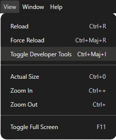
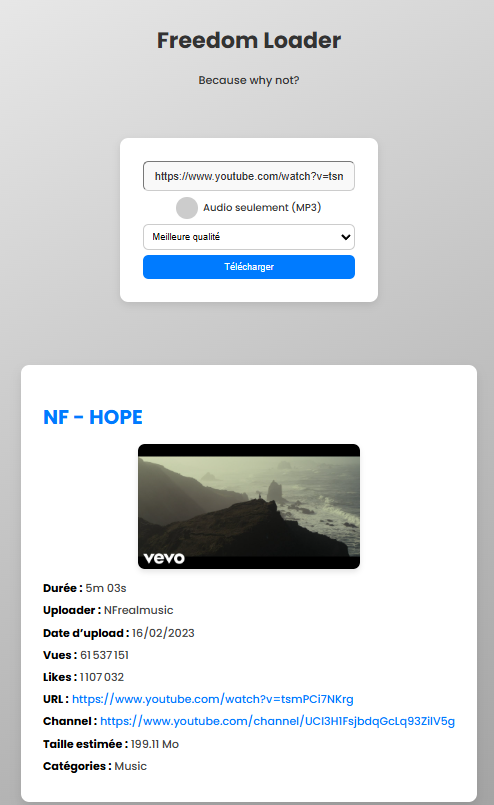

# Freedom Loader

 

> Ce projet a pour but de permettre le téléchargement de contenu Vidéo/Audio de manière gratuite, open source et libre. Il permettra à terme de choisir

## 🚀 Fonctionnalités

✅ Téléchargement Vidéo (MP4)  
✅ Téléchargement Audio (MP3)  
✅ Logs détaillés (console + fichiers logs)  
✅ Récupération automatique des informations  
✅ Téléchargement des playlists
✅ Choix de thèmes
✅ Choix du chemin de sortie des vidéos personnalisés

---

## 🔧 Installation

Pour installer l'application, il vous suffit de télécharger l'installateur dans la section releases, de prendre la dernière version et de l'exécuter.

---

## ❓ Questions fréquentes

### _Où se situent mes fichiers une fois téléchargés ?_

Dans le dossier Téléchargements (**C:\Users\VOTRE NOM\Downloads**) de votre ordinateur, dans un dossier nommé **Freedom Loader Output**  
 

### _Une fois le programme installé et lancé, j'ai une erreur_

Essayez de relancer l'application, de consulter les logs ou d'ouvrir la console de développement du navigateur en faisant le raccourci `CTRL + SHIFT + I` ou via `View > Toggle Developer Tools`.

<!--  -->

  

## 🏗️ Fonctionnalités à venir (Roadmap)

- [ ] Plus de choix de formats
- [ ] Support des sous-titres
- [ ] Meilleure UI / UX
- [ ] Choix des langues
- [ ] Téléchargement d’une partie de la vidéo
- [ ] Renommage du fichier de sortie
- [ ] Extraction / découpage de la vidéo via chapitrage natif
- [ ] Téléchargements parallèles
- [ ] Suppression automatique des parties sponsorisées (skip sponsor)
- [ ] Choix personnalisé du chemin de sortie (par défaut **C:\Users\Utilisateur\Downloads**, où un dossier **Freedom Loader Output** sera créé)

---

## 🖼️ Aperçu

  

> Voici un exemple de l’application lancée après avoir saisi une URL.

---

## ℹ️ À propos

Ce projet a été réalisé en utilisant   
Merci à eux de nous permettre d’utiliser leur API gratuitement et en open source.

Ce projet est open source et accueille volontiers vos contributions.  
Voici comment participer :

- **🪲 Signalement de bugs**  
   Merci d’utiliser le [système d’issues GitHub](https://github.com/MasterAcnolo/Freedom-Loader/issues) pour remonter les bugs rencontrés.  
   Essayez de fournir une reproduction claire et les logs si possible. Les logs se trouvent dans le dossier d’installation du programme. Exemple de chemin :  
  `C:\Users\[VOTRE NOM]\Desktop\Freedom Loader\resources\app\logs`  
  Le fichier aura un nom du type `combined-20xx-xx-xx.log`.  
   
- **🛠️ Contribution**  
   Les Pull Requests sont les bienvenues ! Merci de forker le repo et de soumettre votre PR après avoir vérifié le respect des guidelines (tests, style, etc.).  
   
- **💡 Suggestions de fonctionnalités**  
   Vous pouvez proposer de nouvelles idées via une [issue de type feature request](https://github.com/MasterAcnolo/Freedom-Loader/issues).  
   Toute proposition claire et détaillée sera étudiée.  
   
- **💰 Soutenir le projet**
    
  
    Si vous souhaitez m’encourager, vous pouvez faire un don sur  
      
    

---

## 📄 Licence

Ce projet est sous licence **MIT** — voir le fichier [LICENSE](./LICENSE) pour plus d’informations.

---

## ⚠️ Disclaimer

J’ai bien évidemment eu recours à l’IA pour m’aider sur certaines parties du projet. Utilisez l’IA avec parcimonie et soyez toujours conscient de ce que vous faites.
